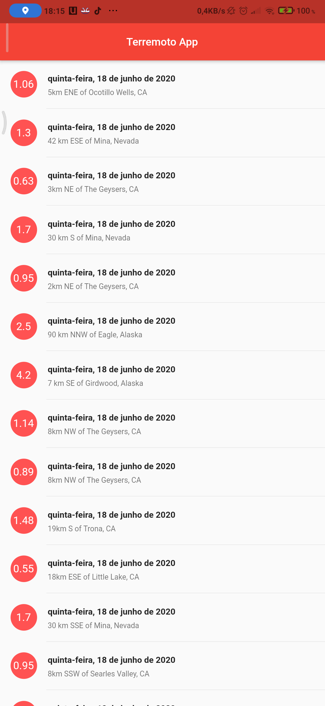

 

<h2 align="center">EarthQuake App</h2>

A simple app to view recent earthquake data using the <a href="https://earthquake.usgs.gov/earthquakes/feed/v1.0/summary/all_day.geojson">USGS API</a>

</img>

## Getting Started for new Flutter project

This project is maked using the Flutter framekork.

A few resources to get you started if this is your first Flutter project:

- [Lab: Write your first Flutter app](https://flutter.dev/docs/get-started/codelab)
- [Cookbook: Useful Flutter samples](https://flutter.dev/docs/cookbook)

For help getting started with Flutter, view our
[online documentation](https://flutter.dev/docs), which offers tutorials,
samples, guidance on mobile development, and a full API reference.
